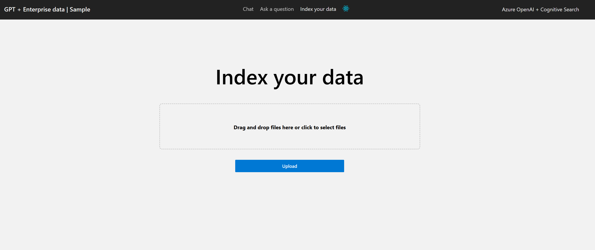
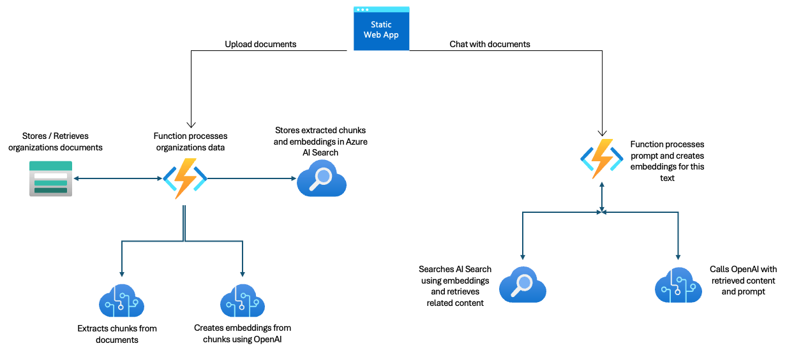

# Chat + Enterprise data with Azure OpenAI and Azure Functions

This demo is based on [azure-search-openai-demo](https://github.com/Azure-Samples/azure-search-openai-demo) and uses a static web app for the frontend and Azure functions for the backend API's.

This solution uses the [Azure Functions OpenAI triggers and binding extension](https://github.com/Azure/azure-functions-openai-extension) for the backend capabilities. It includes:

- Ability to upload text files from UI - Delivered by the embeddings and semantic search output bindings
- Ask questions of the uploaded files - Enabled by the semantic search input binding
- Create a chat session and interact with the OpenAI deployed model -  Uses the Assistant bindings to interact wiht the OpenAI model and stores chat history in Azure storage tables automatically
- In the chat session, ask the LLM to store reminders and then later retrieve them. This capability is delivered by the AssistantSkills trigger in the OpenAI extension for Azure Functions
- Create Azure functions in different programming language e.g. (C#, Node, Python, Java, PowerShell) and easily replace using config file
- Static web page is configured with AAD auth by default

### High Level Overview of components

## Getting Started

> **IMPORTANT:** In order to deploy and run this example, you'll need an **Azure subscription with access enabled for the Azure OpenAI service**. You can request access [here](https://aka.ms/oaiapply). You can also visit [here](https://azure.microsoft.com/free/cognitive-search/) to get some free Azure credits to get you started.

> **AZURE RESOURCE COSTS** by default this sample will create Azure App Service and Azure AI Search resources that have a monthly cost. You can switch them to free versions of each of them if you want to avoid this cost by changing the parameters file under the infra folder (though there are some limits to consider; for example, you can have up to 1 free AI Search resource per subscription.)

### Prerequisites

#### To Run Locally

- [Azure Developer CLI](https://aka.ms/azure-dev/install)
- [.NET 8](https://dotnet.microsoft.com/en-us/download/dotnet/8.0) - Backend Functions app is built using .NET 8
- [Node.js](https://nodejs.org/en/download/) - Frontend is built in TypeScript
- [Git](https://git-scm.com/downloads)
- [Powershell 7+ (pwsh)](https://github.com/powershell/powershell) - For Windows users only.
  - **Important**: Ensure you can run `pwsh.exe` from a PowerShell command. If this fails, you likely need to upgrade PowerShell.
- [Static Web Apps Cli](https://github.com/Azure/static-web-apps-cli#azure-static-web-apps-cli)
- [Azure Cli](https://learn.microsoft.com/en-us/cli/azure/install-azure-cli)
- [Azure Functions Core Tools](https://learn.microsoft.com/en-us/azure/azure-functions/functions-run-local?tabs=v4%2Clinux%2Ccsharp%2Cportal%2Cbash#install-the-azure-functions-core-tools)

> NOTE: Your Azure Account must have `Microsoft.Authorization/roleAssignments/write` permissions, such as [User Access Administrator](https://learn.microsoft.com/azure/role-based-access-control/built-in-roles#user-access-administrator) or [Owner](https://learn.microsoft.com/azure/role-based-access-control/built-in-roles#owner).

### Installation

#### Project Initialization

1. Create a new folder and switch to it in the terminal
1. Run `azd login`
2. Run `az account set --subscription "<your target subscription>"`
3. Run `azd init`
   - For the target location, the regions that currently support the models used in this sample are **East US** or **South Central US**. For an up-to-date list of regions and models, check [here](https://learn.microsoft.com/en-us/azure/cognitive-services/openai/concepts/models).  Make sure that all the intended services for this deployment have availability in your targeted regions.

#### Starting from scratch

Execute the following command, if you don't have any pre-existing Azure services and want to start from a fresh deployment.

1. Run `azd up` - This will provision Azure resources and deploy this sample to those resources
2. After the application has been successfully deployed you will see a URL printed to the console. Click that URL to interact with the application in your browser.

> NOTE: It may take a minute for the application to be fully deployed.

#### Use existing resources

1. Run `azd env set AZURE_OPENAI_SERVICE {Name of existing OpenAI service}`
2. Run `azd env set AZURE_OPENAI_RESOURCE_GROUP {Name of existing resource group that OpenAI service is provisioned to}`
3. Run `azd env set AZURE_OPENAI_CHATGPT_DEPLOYMENT {Name of existing ChatGPT deployment}`. Only needed if your ChatGPT deployment is not the default 'chat'.
4. Run `azd env set AZURE_OPENAI_GPT_DEPLOYMENT {Name of existing GPT deployment}`. Only needed if your ChatGPT deployment is not the default 'davinci'.
5. Run `azd up`

> NOTE: You can also use existing Search and Storage Accounts. See `./infra/main.parameters.json` for list of environment variables to pass to `azd env set` to configure those existing resources.

#### Deploying or re-deploying a local clone of the repo

- Simply run `azd up`

### Quickstart

- In Azure: navigate to the Azure WebApp deployed by azd. The URL is printed out when azd completes (as "Endpoint"), or you can find it in the Azure portal.
- Running locally: navigate to 127.0.0.1:5000

Once in the web app:

- Try different topics in chat or Q&A context. For chat, try follow up questions, clarifications, ask to simplify or elaborate on answer, etc.
- Explore citations and sources
- Click on "settings" to try different options, tweak prompts, etc.

## Resources

- [Primary Repo - azure-search-openai-demo](https://github.com/Azure-Samples/azure-search-openai-demo)
- [Revolutionize your Enterprise Data with ChatGPT: Next-gen Apps w/ Azure OpenAI and AI Search](https://aka.ms/entgptsearchblog)
- [Azure AI Search](https://learn.microsoft.com/azure/search/search-what-is-azure-search)
- [Azure OpenAI Service](https://learn.microsoft.com/azure/cognitive-services/openai/overview)

## How to purge aad auth

To remove your data from Azure Static Web Apps, go to <https://identity.azurestaticapps.net/.auth/purge/aad>

## Upload files failures

Currently only text files are supported.

## Azure Functions troubleshooting

Go to Application Insights and go to the Live metrics view to see real time telemtry information.
Optionally, go to Application Insights and select Logs and view the traces table
